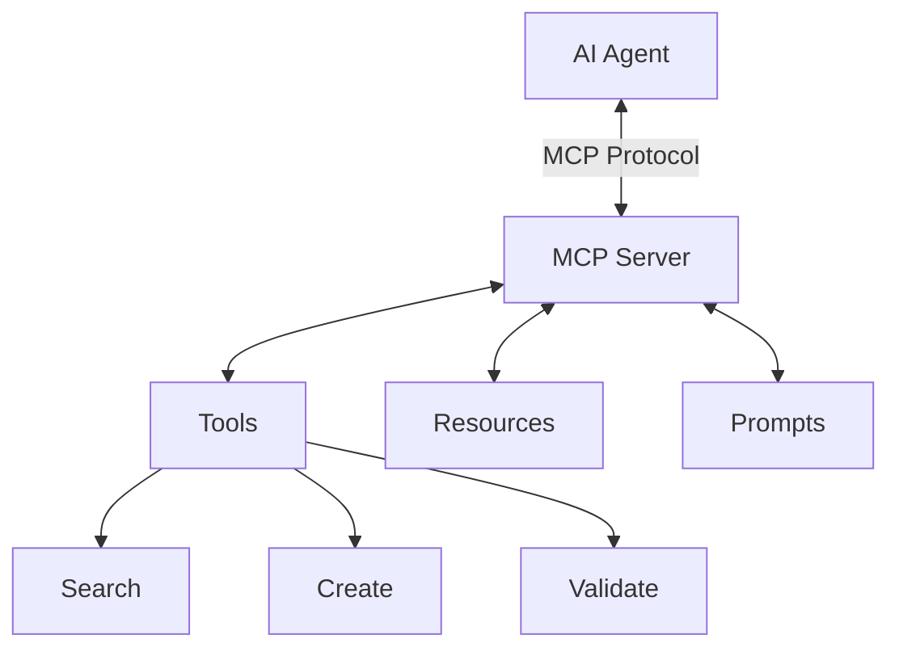
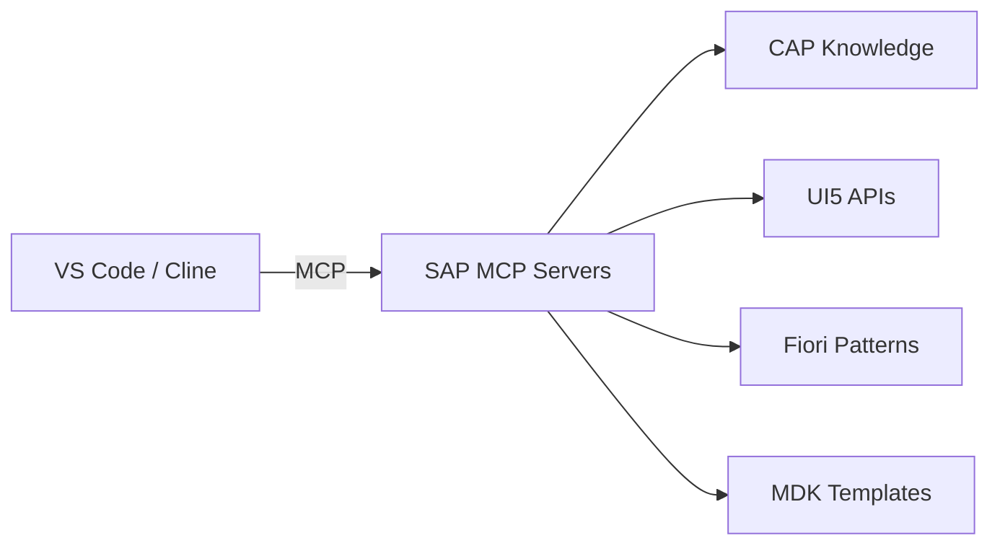
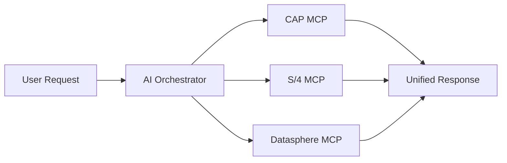

# MCP'fication of SAP

## How the Model Context Protocol is Transforming SAP

<div class="pt-12">
  <span class="px-2 py-1 rounded cursor-pointer" hover="bg-white bg-opacity-10">
    by Hendrik Neumann with Claude & Codex
  </span>
</div>

<!--
Welcome to this talk about how MCP is revolutionizing SAP development.
After SAP TechEd 2025, this is one of the hottest topics in the SAP ecosystem.
-->

---
layout: image
image: ./agenda_background.png
---

# Agenda

<v-clicks>

1. **What is MCP?** - Quick introduction
2. **SAP TechEd 2025** - The turning point
3. **MCP Server Ecosystem** - SAP official & community
4. **What's Possible Today** - Real-world use cases
5. **Outlook** - What's coming next

</v-clicks>

---
layout: section
---

# What is MCP?

Model Context Protocol - The Universal AI Connector

---
layout: image
image: ./usbc_mcp_network.png
---

# Model Context Protocol (MCP)

<div class="grid grid-cols-2 gap-8">
<div>

<v-clicks>

- **Open standard** by Anthropic
- Enables **structured communication** between LLMs and external systems
- Provides **tools**, **resources**, and **prompts**
- Think of it as **"USB-C for AI"**

</v-clicks>

</div>
<div v-click>



</div>
</div>

<!--
MCP standardizes how AI models interact with external systems.
It's becoming the de-facto standard for AI tool integration.
-->

---
layout: section
---

# SAP TechEd 2025

The MCP'fication of SAP started

---
layout: image-right
image: Ameling-MCP-TechEd2025.png
backgroundSize: contain
---

# SAP TechEd 2025 Announcements

SAP positioned MCP as the key standard for the **"Agentic Enterprise"**

<v-clicks>

- **Open-sourced MCP Servers** for CAP, UI5, Fiori, MDK, ABAP (Q2/2026)
- **MCP Support** in SAP Build & VS Code
- **Integration Suite MCP Gateway**
- **Joule Studio** MCP interoperability

</v-clicks>

<div v-click class="mt-4 text-sm opacity-75">

> "MCP is the new kid on the block" — SAP TechEd Keynote

</div>

<!--
At TechEd 2025, SAP made a major commitment to MCP.
This wasn't just announcements - they released working code.
-->

---
layout: two-cols
---
# Featured TechEd Sessions
A selection from the session catalog

**BTM260**
Building AI Agents with SAP LeanIX & MCP

**CA261**
Create Great UX with AI, SAP Design System & MCP

**Developer Keynote**
Live MCP AI Agents demo in VS Code

**Agentic Coding**
Extending CAP and Fiori with MCP

::right::
<div class="flex flex-col items-left gap-4">
<div v-click>
 
 </div>
<div v-click class="mt-8">



</div>
</div>

---
layout: section
---

# MCP Server Ecosystem

SAP Official & Community Servers

---

# SAP Development MCP Server

<div class="grid grid-cols-4 gap-4 text-center">
<div v-click class="p-4 bg-blue-500 bg-opacity-20 rounded">

### 🧢 CAP
`@cap-js/mcp-server`

Model & Docs Search

</div>
<div v-click class="p-4 bg-green-500 bg-opacity-20 rounded">

### 🌺 Fiori
`@sap-ux/fiori-mcp-server`

App Generation & Editing

</div>
<div v-click class="p-4 bg-orange-500 bg-opacity-20 rounded">

### 5️⃣ UI5
`@sapui5/mcp-server`

APIs, Linting, Scaffolding

</div>
<div v-click class="p-4 bg-purple-500 bg-opacity-20 rounded">

### 📱 MDK
`@sap/mdk-mcp-server`

Mobile App Development

</div>
</div>

<div v-click class="mt-8 text-center">

All servers are **open-source** under Apache-2.0 license

</div>

---

# Example: CAP MCP Server

Transforms AI agents into **CAP development experts**

<div class="grid grid-cols-2 gap-8">
<div>

**Tools:**

<v-clicks>

- `search_model` - Fuzzy search across CDS models
- `search_docs` - Semantic search in CAP docs

</v-clicks>

<div v-click class="mt-4">

**Capabilities:**

- Entity relationships
- Annotations & metadata
- HTTP endpoint info
- Handler implementation help

</div>

</div>
<div v-click>

```ts
// AI can now understand your model
service CatalogService {
  entity Products {
    key ID : UUID;
    title : String;
    price : Decimal;
  }
  action order(quantity: Integer);
}
```

<div class="text-sm mt-2 opacity-75">

AI knows: entities, actions, relationships, best practices

</div>

</div>
</div>

---

# Fiori MCP Server

**Generate and edit** SAP Fiori applications via AI

<v-clicks>

**Key Features:**
- Generate Fiori elements apps for CAP projects
- Locate and edit existing applications
- Built-in **safeguards** for proper patterns
- Validates UUID keys, sample data consistency

**Available Tools:**
- App discovery in workspaces
- Page editing capabilities
- Pattern-compliant code generation

</v-clicks>

<div v-click class="mt-4 p-3 bg-yellow-500 bg-opacity-20 rounded">

⚠️ **Experimental** - Rapidly evolving with planned doc search & broader OData support

</div>

---

# UI5 MCP Server

**Six powerful tools** for UI5 development

<div class="grid grid-cols-2 gap-4">
<div>

| Tool | Purpose |
|------|---------|
| `get_guidelines` | UI5 best practices |
| `create_ui5_app` | Project scaffolding |
| `get_api_reference` | API search & validation |
| `run_ui5_linter` | Deprecation detection |
| `get_project_info` | Project metadata |
| `get_version_info` | Framework versions |

</div>
<div v-click>

**Why it matters:**

<v-clicks>

- LLMs lack **current** UI5 knowledge
- Often recommend **deprecated** APIs
- MCP server provides **version-aware** guidance
- **Auto-fixes** deprecation issues

</v-clicks>

</div>
</div>

---

# MDK MCP Server

AI-powered **mobile app development**

<div class="grid grid-cols-2 gap-8">
<div>

**Four Core Tools:**

<v-clicks>

1. `mdk-create` - Project/entity creation
2. `mdk-gen` - Generate pages, actions, rules
3. `mdk-manage` - Build, deploy, validate
4. `mdk-docs` - Documentation & schemas

</v-clicks>

</div>
<div v-click>

**Templates Available:**
- CRUD operations
- List-Detail views
- Base applications

<div class="mt-4">

```bash
npm install @sap/mdk-mcp-server
```

</div>

</div>
</div>

---

# Community Server Ecosystem

<div class="grid grid-cols-3 gap-4 text-sm">
<div v-click class="p-3 bg-blue-500 bg-opacity-10 rounded">

### 📘 Documentation
- **mcp-sap-docs** - UI5, CAP, ABAP docs
- **mcp-sap-notes** - SAP Notes search
- 17 sources, 53,000+ files

</div>
<div v-click class="p-3 bg-green-500 bg-opacity-10 rounded">

### 🧑‍💻 Development
- **mcp-abap-adt** - ABAP system access
- **mcp-sap-gui** - GUI automation
- **cap-mcp-plugin** - Auto MCP from CAP

</div>
<div v-click class="p-3 bg-purple-500 bg-opacity-10 rounded">

### 📡 Data Access
- **OData MCP Bridge** - Universal connector
- **HANA MCP Server** - ML operations
- **Datasphere MCP** - Analytics access

</div>
</div>

<div v-click class="mt-6">

**Key Contributors:** marianfoo, mario-andreschak, oisee, lemaiwo, gavdilabs

</div>

---

# SAP Docs MCP Server

**Unified access** to SAP documentation

<div class="grid grid-cols-2 gap-8">
<div>

**Coverage:**
- ABAP: 40,800+ files
- UI5: 12,000+ files
- CAP: 250+ files
- Cloud SDK: 500+ files
- Testing: 260+ files

</div>
<div>

**Tools:**

```
search        - Query all sources
fetch         - Get full documents
sap_community_search
sap_help_search
sap_help_get
```

</div>
</div>

<div v-click class="mt-4">

```json
{
  "mcpServers": {
    "sap-docs": {
      "url": "https://mcp-sap-docs.marianzeis.de/mcp"
    }
  }
}
```

</div>

---

# ABAP MCP Server

Bringing AI to Eclipse-based ABAP development

<v-clicks>

**Problem:** Joule isn't available for on-premise S/4HANA

**Solution:** Community MCP server for GitHub Copilot in Eclipse

**Knowledge Sources:**
- Official ABAP Keyword Documentation
- DSAG Development Guidelines
- ABAP Style Guide
- SAP Community & Help
- ABAP Feature Matrix

**Why it matters:** Only practical AI option for on-premise ABAP developers

</v-clicks>

---

# OData MCP Bridge - Game Changer

> "When 15,000+ services become AI-accessible overnight, MCP becomes the enterprise standard"

<v-clicks>

**The Insight:** OData already has machine-readable metadata

**The Solution:** Translate metadata → MCP tool definitions

**Scale:**
- SAP Systems: ~10,000 services
- Microsoft Dynamics: ~1,500
- Salesforce: ~800
- Oracle Cloud: ~2,000

**Impact:** Natural language access to enterprise data

</v-clicks>

<div v-click class="mt-2 text-sm">

```
User: "Approve all POs under $50k"
→ AI calls OData service → Done
```

</div>

---
layout: section
---

# What's Possible Today

Real-World Use Cases

---

# Current Capabilities

<div class="grid grid-cols-2 gap-8">
<div>

### Development Acceleration

<v-clicks>

- **CAP:** Generate handlers, understand models
- **UI5:** Scaffold apps, fix deprecations
- **Fiori:** Create compliant applications
- **MDK:** Build mobile apps faster

</v-clicks>

</div>
<div>

### Knowledge Access

<v-clicks>

- Search 53,000+ doc files instantly
- Query SAP Notes with AI
- Access ABAP guidelines
- Get version-specific API info

</v-clicks>

</div>
</div>

<div v-click class="mt-6 p-4 bg-green-500 bg-opacity-20 rounded">

**Demo Setup:** Claude Desktop + Cline + SAP MCP Servers = AI-powered SAP development

</div>

---
layout: section
---

# Outlook

What's Coming Next

---

# Future Possibilities

<div class="grid grid-cols-2 gap-8">
<div>

### Near Term

<v-clicks>

- **SAP AI Core** integration with Cline
- **Joule Studio** MCP extensions
- **Integration Suite** MCP Gateway GA
- More community servers

</v-clicks>

</div>
<div>

### Long Term

<v-clicks>

- **Agent-to-agent** communication
- **Autonomous workflows** across systems
- **Real-time** business process orchestration
- **Natural language** SAP administration

</v-clicks>

</div>
</div>

<div v-click class="mt-6">



</div>

---

# Challenges & Considerations

<div class="grid grid-cols-2 gap-8">
<div>

### Technical

<v-clicks>

- Authentication complexity
- Large dataset handling
- Rate limiting & quotas
- Connection stability

</v-clicks>

</div>
<div>

### Organizational

<v-clicks>

- Data governance
- Authorization mapping
- Audit requirements
- Change management

</v-clicks>

</div>
</div>

<div v-click class="mt-6 p-3 bg-yellow-500 bg-opacity-20 rounded">

💡 **Best Practice:** Start with read-only documentation access, then expand

</div>

---

# Getting Started

<div class="grid grid-cols-2 gap-8">
<div>

### 1. Install MCP Client

```bash
# Claude Desktop, Cline, or Cursor
```

### 2. Add SAP MCP Servers

```json
{
  "mcpServers": {
    "cap": {
      "command": "npx",
      "args": ["@cap-js/mcp-server"]
    },
    "sap-docs": {
      "url": "https://mcp-sap-docs..."
    }
  }
}
```

</div>
<div>

### 3. Start Developing

<v-clicks>

- Ask about CAP best practices
- Generate Fiori applications
- Search SAP documentation
- Validate UI5 code

</v-clicks>

<div v-click class="mt-4">

### Resources:
- github.com/cap-js/mcp-server
- github.com/SAP/open-ux-tools
- github.com/marianfoo/mcp-sap-docs

</div>

</div>
</div>

---

# Key Resources

| Category | Resource |
|----------|----------|
| **SAP Official** | github.com/cap-js/mcp-server |
| | github.com/SAP/open-ux-tools |
| | github.com/UI5/mcp-server |
| | github.com/SAP/mdk-mcp-server |
| **Community** | github.com/marianfoo/mcp-sap-docs |
| | github.com/mario-andreschak/mcp-abap-adt |
| | github.com/oisee/odata_mcp_go |
| **Protocol** | modelcontextprotocol.io |

---
layout: center
class: text-center
---

# Thank You!

MCP'fication of SAP

<div class="pt-8 text-xl">
  Questions?
</div>

<div class="pt-8 text-sm opacity-75">

SAP TechEd 2025 marked the beginning of the Agentic Enterprise era.

MCP is the bridge between AI and SAP systems.

</div>

<!--
Thank you for attending!
The SAP ecosystem is rapidly adopting MCP.
Now is the time to start experimenting.
-->
