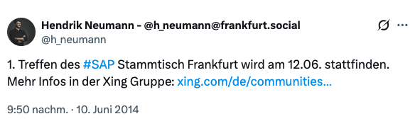
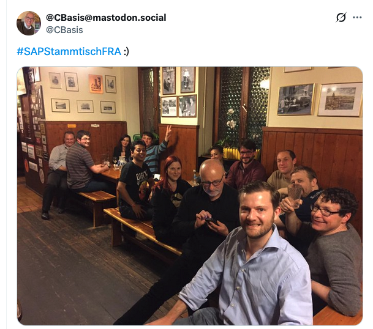
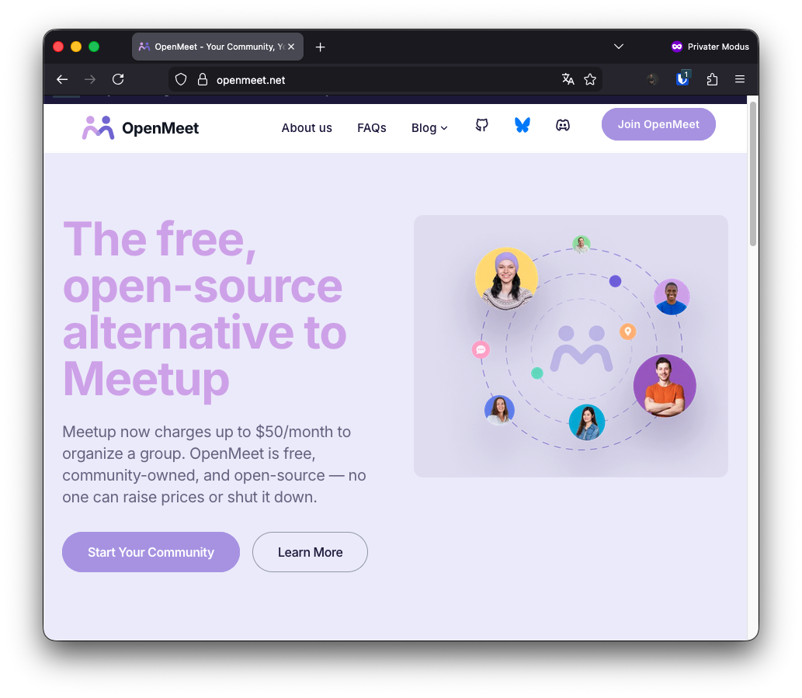
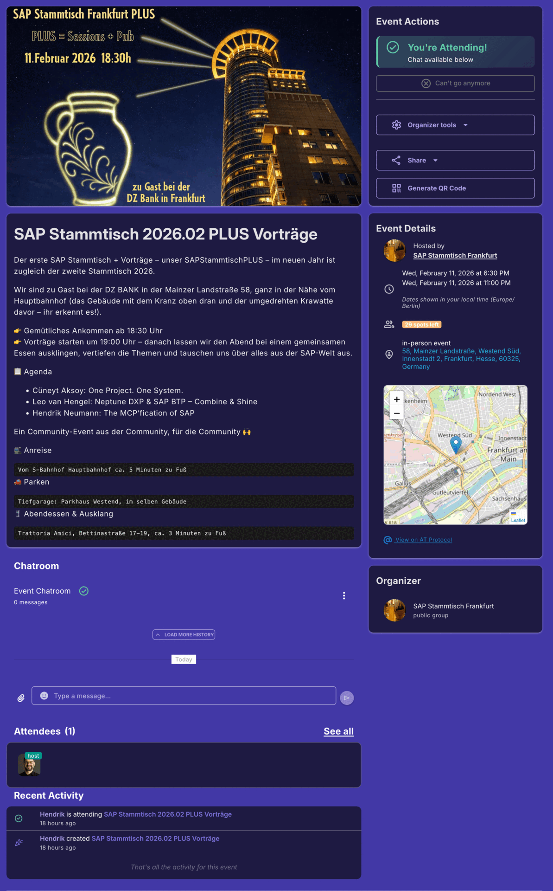
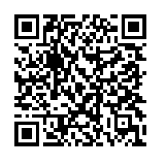
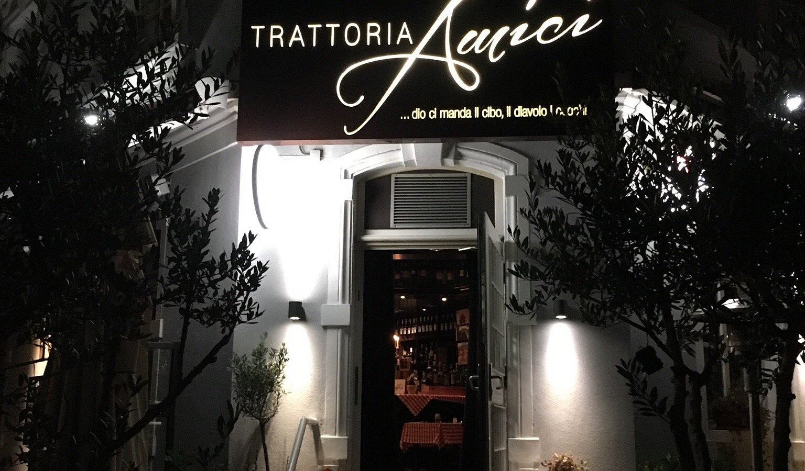
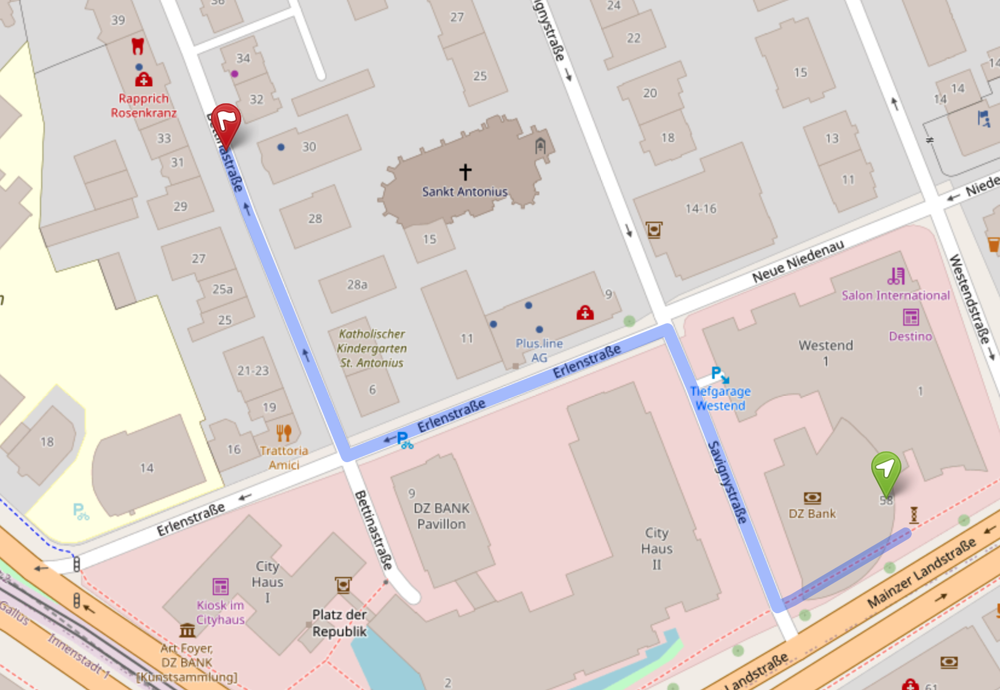

---
# keep the existing theme
theme: the-unnamed
# cover image for the title slide
background: ./Skyline-sundown.jpg
# deck meta
title: SAP Stammtisch Frankfurt PLUS - Februar 2026
info: |
  ## SAP Stammtisch Frankfurt PLUS
  11. Februar 2026 · DZ BANK Frankfurt

  Community-Event seit 2014 · Stammtisch Nr. 94
class: text-center
transition: slide-left
mdc: true
duration: 25min
---

# SAP Stammtisch Frankfurt PLUS

11.Februar 2026 · 18:30 Uhr

DZ BANK · Frankfurt am Main

  Hendrik Neumann with Claude & Codex

---
layout: image
image: ./DZBANK-Turm.jpg
---

# Gastgeberin: DZ BANK

Danke an unsere Gastgeberin, die **DZ BANK** und

**Alex Reincke** für die Organisation!

---
layout: section
---

# SAP Stammtisch Frankfurt

---
layout: two-cols
layoutClass: gap-8
---

# Community Event seit 2014

- Von der Community, für die Community
- Heute: Stammtisch Nr. 94
- Sonderformat: PLUS Vorträge
- Nächster Meilenstein: Nr. 100 im August

::right::

  
  

---
layout: image-right
image: ./SAP-StammtischPlus2025-02.jpg
---

# Besonderheit: PLUS Vorträge

Mehr Austausch, mehr Inhalte, mehr Community.

---
layout: image-left
image: ./Stammtisch-Bembel.jpg
---

# Klassik: Apfelweinkneipe

Der SAP Stammtisch-Urklassiker in Frankfurt.

---
layout: image-right
image: ./Weihnachtsmarkt.jpg
---

# Moderne Klassiker: Weihnachtsmarktbesuch

Gemeinsam Glühwein und Jahresabschluss.

---
layout: center
---

# Stammtisch Nr. 100

August 2026 · Save the Date!

---
layout: section
---

# Meetup: Kostenexplosion

---
layout: two-cols
---
# Was ist passiert?

- Mai 2024: 35 USD / 6 Monate
- Mai 2026: 119 USD / 6 Monate

Wir brauchen eine faire, nachhaltige Alternative. Meetup ist es nicht.

::right::

---
layout: two-cols
---

# Vorschlag: openMeet

**Free, Forever**

No subscription fees. No ads. Open-source and community-owned.

  

::right::

  

---
layout: two-cols
layoutClass: gap-8
---

# Wechsel zu openMeet

- Plattform: openmeet.net
- Community-Gruppe:
  https://platform.openmeet.net/groups/sap-stammtisch-frankfurt-jhoivw
- Bitte testen und Feedback geben

::right::

  

---
layout: section
---

# Talks

---

# Agenda

- Cueneyt Aksoy: One Project. One System.
- Leo van Hengel: Neptune DXP & SAP BTP - Combine & Shine
- Hendrik Neumann: The MCP'fication of SAP

---
layout: section
---

# Ausklang

---
layout: two-cols
layoutClass: gap-8
---

# Abendessen & Ausklang

- Trattoria Amici
- Bettinastrasse 17-19
- ca. 3 Minuten zu Fuss

::right::

  
  

---
layout: end
class: text-center
---

# Danke fürs Dabeisein

Nächster Stammtisch im März 2026!

**Viel Spaß!**
